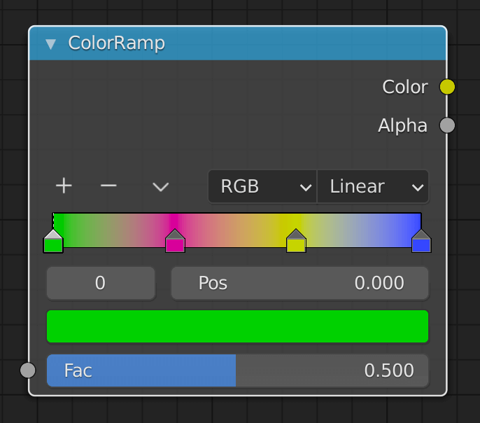
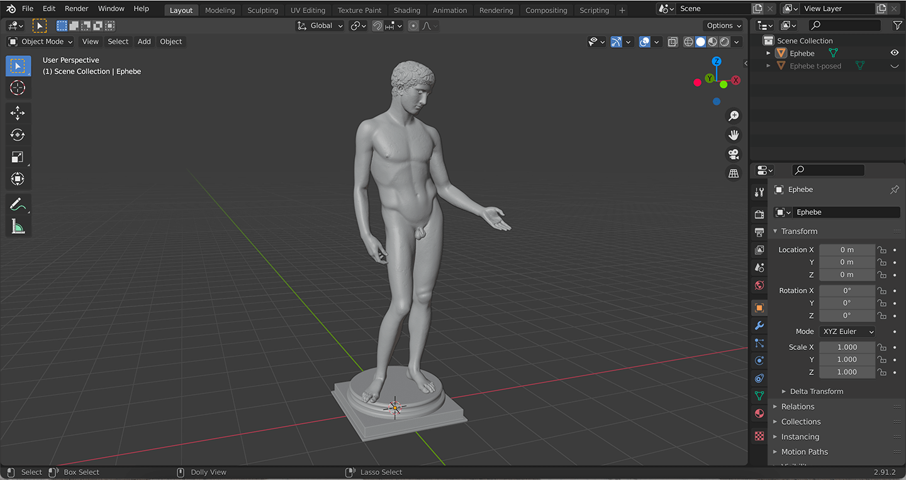
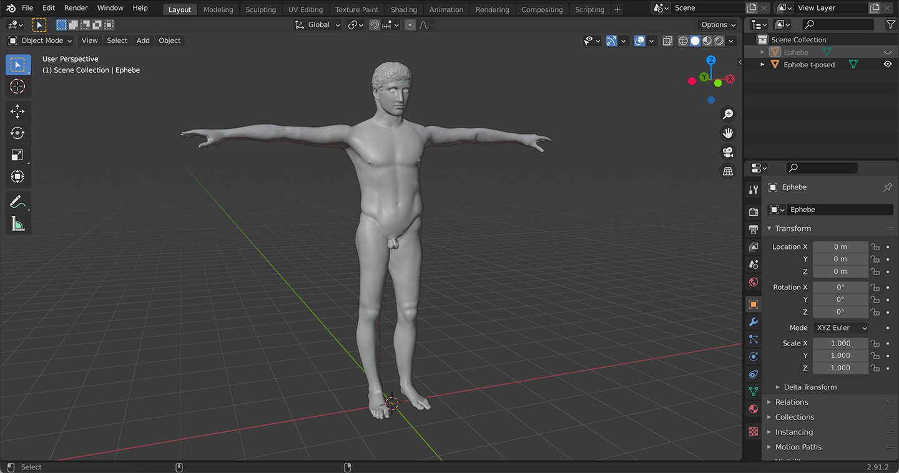
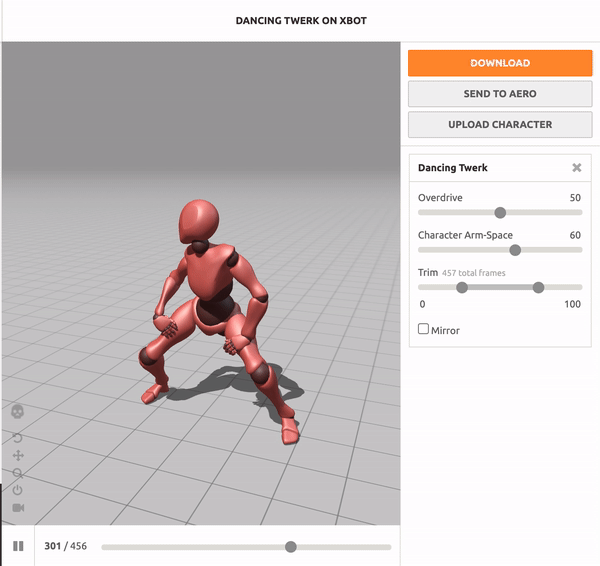

# webgl-iridescence-twerk

> Some cool ass iridescent effect

Built with [threejs-modern-app](https://github.com/marcofugaro/threejs-modern-app).

## Highlights

- The **iridescence** effects boils down to colors mapped to the fresnel effect. I explored three ways of doing this:

1. Use the `mod()` function to map the whole HSL color wheel to the fresnel value. [The full code is here](https://github.com/marcofugaro/webgl-iridescence-twerk/blob/4c962a58a11be75c9b2b34478c4ddd73ab672fe2/src/scene/Ephebe.js#L80-L91).

```c
// circle the whole hue wheel,
// the function looks like this /|/|/|/|/
float f = mod(iridescence, 1.0);

vec3 iridescentColor = hsl2rgb(f, 1.0, 0.5);
```

2. Alternate between two colors with a [ping-pong](https://docs.unity3d.com/ScriptReference/Mathf.PingPong.html) function. [The full code is here](https://github.com/marcofugaro/webgl-iridescence-twerk/blob/4c962a58a11be75c9b2b34478c4ddd73ab672fe2/src/scene/Hills.js#L126-L138).

```c
// alternate between two colors,
// the function looks like this /\/\/\/\/
float f = abs(1.0 - mod(iridescence, 2.0));

vec3 iridescentColor = mix(firstColor, secondColor, f);
```

3. Cycle between more than two colors using weights.

```c
float f = iridescence;

// the step values
float step1 = 0.0;
float step2 = 0.33;
float step3 = 0.66;
float step4 = 1.0;

// the step colors
vec3 firstColor = vec3(...);
vec3 secondColor = vec3(...);
vec3 thirdColor = vec3(...);
vec3 fourthColor = vec3(...); // this must be the same of the first color to prevent a harsh color change

// this is a gradient step
// first color is the front one, the last color is the perpendicular one
vec3 iridescentColor = mix(firstColor, secondColor, smoothstep(step1, step2, f));
iridescentColor = mix(iridescentColor, thirdColor, smoothstep(step2, step3, f));
iridescentColor = mix(iridescentColor, fourthColor, smoothstep(step3, step4, f));
```

This is similar to the ColorRamp node in Blender.



- The **normals** after the vertex shader displacement in the hills were calculated using [this method](https://discourse.threejs.org/t/calculating-vertex-normals-after-displacement-in-the-vertex-shader/16989). Relevant code is [here](https://github.com/marcofugaro/webgl-iridescence-twerk/blob/4c962a58a11be75c9b2b34478c4ddd73ab672fe2/src/scene/Hills.js#L66-L100).

```c
// http://lolengine.net/blog/2013/09/21/picking-orthogonal-vector-combing-coconuts
vec3 orthogonal(vec3 v) {
  return normalize(abs(v.x) > abs(v.z) ? vec3(-v.y, v.x, 0.0)
  : vec3(0.0, -v.z, v.y));
}

// the function which defines the displacement
float frequency = 0.4;
float speed = 0.05;
float displace(vec3 point) {
  // distance from center
  float distance = hypot(point.xz);
  float amplitude = pow(distance, 2.0) * 0.05;
  return (noise(vec3(point.xz * frequency, timeFixed * speed)) * 0.5 + 0.5) * amplitude;
}

// ...

vec3 displacedPosition = position + normal * displace(position);

float offset = 0.01;
vec3 tangent = orthogonal(normal);
vec3 bitangent = normalize(cross(normal, tangent));
vec3 neighbour1 = position + tangent * offset;
vec3 neighbour2 = position + bitangent * offset;
vec3 displacedNeighbour1 = neighbour1 + normal * displace(neighbour1);
vec3 displacedNeighbour2 = neighbour2 + normal * displace(neighbour2);

// https://i.ya-webdesign.com/images/vector-normals-tangent-16.png
vec3 displacedTangent = displacedNeighbour1 - displacedPosition;
vec3 displacedBitangent = displacedNeighbour2 - displacedPosition;

// https://upload.wikimedia.org/wikipedia/commons/d/d2/Right_hand_rule_cross_product.svg
vec3 displacedNormal = normalize(cross(displacedTangent, displacedBitangent));
```

- The model was downloaded from [threedscans.com](http://threedscans.com/museo-archeologico-nazionale/efebo/), I then t-posed it in Blender:

| Before                                             | After                                                    |
| -------------------------------------------------- | -------------------------------------------------------- |
|  |  |

After that, I used [Mixamo](https://www.mixamo.com/) to attach the animation to the mesh.



## Usage

Once you installed the dependencies running `yarn`, these are the available commands:

- `yarn start` starts a server locally
- `yarn build` builds the project for production, ready to be deployed from the `build/` folder

All the build tools logic is in the `package.json` and `webpack.config.js`.

### [Read the full documentation for a more in-depth guide](https://github.com/marcofugaro/threejs-modern-app)
